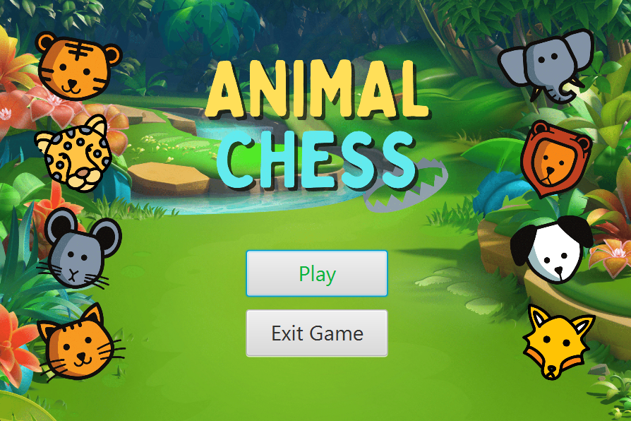
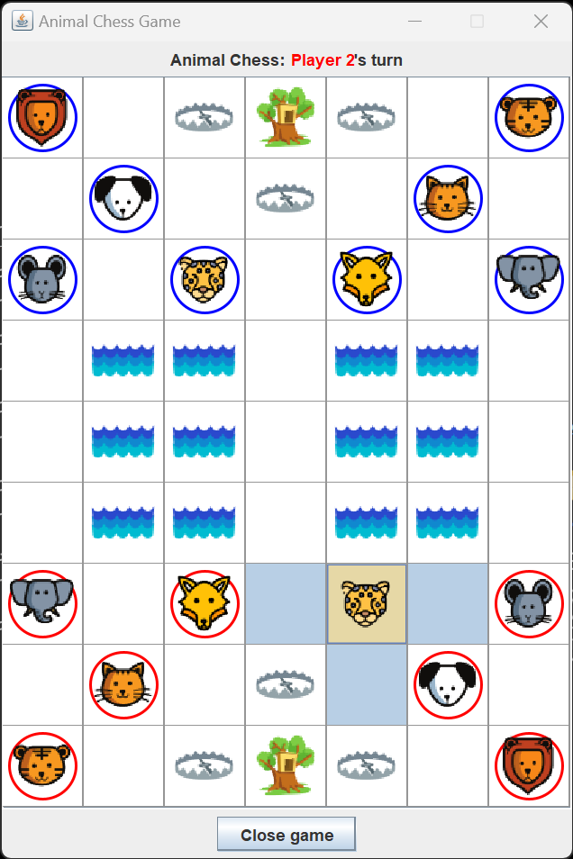

# Animal Chess

Animal Chess is a two-player game that uses animals with rank (and some with special ability) as pieces. This project was developed as part of the requirements for the Introductory Programming (CCPROG3) class.

## Preview
*Home*

*In-game*

## The Game

Before the start of a game, each player picks one animal piece. The one with the higher-ranked animal is the first player. The players will choose a color for their animal pieces (e.g. Player 1 chooses red, Player 2 chooses blue). The player takes turn in moving their animal pieces on the board. Game ends when a player successfully moves any of his animal pieces into his opponent's animal den.

Generally,
- pieces can move one space horizontally or vertically; and
- pieces may land on and capture an opponent's piece that has equal or lower rank.

However the following exceptions apply:

### Movement

- The mouse is the only animal that is allowed to move on the river .
- Both the lion and the tiger can jump from the land before the river to the land after the river, horizontally or vertically, as long as there is no mouse along the way .
- A player may not move his own piece to his own animal den

### Capturing an opponent's piece
- A player may capture an opponent's piece with a higher rank that is on one of his traps .
- An elephant may not capture a mouse while the mouse can capture an elephant.
- A mouse on the river may not capture an elephant or another mouse on land.
- A mouse on the river may capture another mouse on the river .
- A mouse on land may not capture a mouse on the river .

## Features

- Implements the Model-View-Controller (MVC) design pattern
- Allows players to move pieces on the board according to the rules of the game
- Utilizes both JavaFX (Home) and Java Swing (Ingame) UI toolkit
- In-game sound effects for all actions

## How to Play

1. Run [AnimalChess.jar](./others/JARs/AnimalChess.jar).
2. To start the game, go to Play (and read the instructions) > press Ok.
3. Player turns are determined by the chosen animal rank when clicking the provided buttons. The player with the highest rank animal goes first.
4. Follow the rules of the game and try to capture your opponent's animal den to win.

## Credits

- Developed by [Aaron Palpallatoc](https://github.com/ubergonmx) and [Shane Enriquez](https://github.com/janshaaa)

## License

This project is licensed under the BSD-3 License - see the LICENSE file for details.